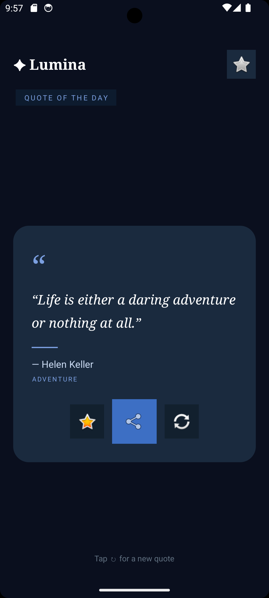
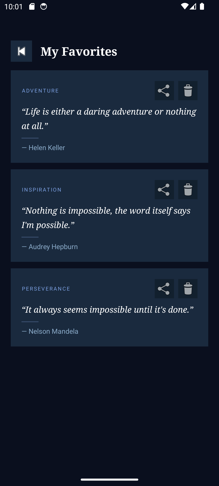

# ✦ Lumina - Quote of the Day

A beautifully designed Android app that inspires you daily with meaningful quotes.

## Features

- 📅 **Quote of the Day** — A new quote every day automatically
- 🔀 **Random Quotes** — Tap refresh to get a new inspiring quote instantly
- ❤️ **Favorites** — Save your favorite quotes and view them anytime
- 📤 **Share** — Share any quote with friends via messaging or social media
- 🌙 **Dark UI** — Elegant deep navy design that's easy on the eyes

## Screenshots

<p align="center">
  
  &nbsp;&nbsp;&nbsp;&nbsp;
  
</p>

<p align="center">
  <em>Home Screen &nbsp;&nbsp;&nbsp;&nbsp;&nbsp;&nbsp;&nbsp;&nbsp;&nbsp;&nbsp;&nbsp;&nbsp;&nbsp;&nbsp;&nbsp;&nbsp;&nbsp;&nbsp; Favorites Screen</em>
</p>

## Tech Stack

- **Language:** Kotlin
- **UI:** XML Layouts
- **Architecture:** Single Activity + Manual Navigation
- **Storage:** SharedPreferences
- **Min SDK:** 24 (Android 7.0)
- **Target SDK:** 37

## Project Structure

```agsl
app/
├── java/com/quoteapp/
│    ├── MainActivity.kt
│    ├── FavoritesActivity.kt
│    ├── FavoritesAdapter.kt
│    ├── FavoritesManager.kt
│    ├── QuoteManager.kt
│    └── Quote.kt
└── res/
├── layout/
│    ├── activity_main.xml
│    ├── activity_favorites.xml
│    └── item_favorite_quote.xml
└── values/
│    ├── colors.xml
│    ├── strings.xml
│    └── themes.xml
```

## Installation

1. Clone the repository
2. Open in Android Studio
3. Sync Gradle
4. Run on emulator or physical device (Android 7.0+)

## License

This project is open source and available under the [MIT License](LICENSE).